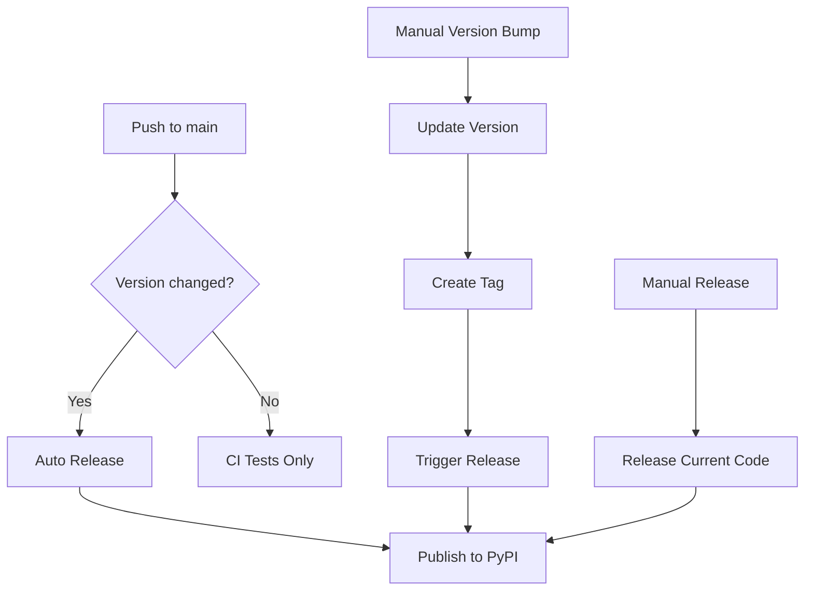

# GitHub Actions Workflows

This repository uses GitHub Actions for automated testing, version management, and releases.

## 🔧 Required Setup

### 1. PyPI Token
To enable automatic publishing to PyPI, you need to set up a PyPI API token:

1. Go to [PyPI Account Settings](https://pypi.org/manage/account/token/)
2. Create a new API token with scope "Entire account" or specific to this project
3. In your GitHub repository, go to Settings → Secrets and variables → Actions
4. Add a new repository secret named `PYPI_TOKEN` with your PyPI token as the value

### 2. GitHub Token
The `GITHUB_TOKEN` is automatically provided by GitHub Actions - no setup required.

## 📋 Available Workflows

### 1. **CI Tests** (`check.yml`)
- **Triggers**: Push to `main`/`develop`, Pull Requests, Monthly schedule
- **Purpose**: Comprehensive testing across multiple OS and Python versions
- **Features**:
  - Tests on Ubuntu, macOS, Windows
  - Python versions: 3.10, 3.11, 3.12
  - Code coverage reporting
  - Linting (Black, isort, flake8, mypy)
  - Security scanning (Bandit, Safety)

### 2. **Auto Release** (`auto-release.yml`)
- **Triggers**: Push to `main` (when version changes), Manual dispatch
- **Purpose**: Automatic release when version is bumped in `pyproject.toml`
- **Features**:
  - Detects version changes automatically
  - Runs full test suite
  - Publishes to PyPI
  - Creates GitHub release with artifacts
  - Requires >80% test coverage

### 3. **Manual Version Bump** (`version-bump.yml`)
- **Triggers**: Manual dispatch only
- **Purpose**: Interactive version bumping with release
- **Features**:
  - Choose bump type: patch/minor/major
  - Dry run option for testing
  - Updates version in all files
  - Creates git tags
  - Automatic release after version bump

### 4. **Manual Release** (`release.yml`)
- **Triggers**: GitHub release creation, Manual dispatch
- **Purpose**: Release from existing code without version changes
- **Features**:
  - Works with existing releases
  - Full test suite before publishing
  - PyPI publishing
  - Release asset uploads

## 🚀 Usage Examples

### Automatic Release (Recommended)
1. Update version in `pyproject.toml`:
   ```toml
   version = "0.2.4"  # Bump from 0.2.3
   ```
2. Commit and push to `main`
3. Auto-release workflow triggers automatically
4. Package is published to PyPI and GitHub release is created

### Manual Version Bump
1. Go to Actions → "Version Bump and Release"
2. Click "Run workflow"
3. Choose version bump type (patch/minor/major)
4. Optionally enable dry run for testing
5. Workflow handles version update and release

### Emergency Manual Release
1. Go to Actions → "Manual Release"
2. Click "Run workflow"
3. Release is created from current code

## 🔍 Workflow Status

You can monitor workflow status in the Actions tab of your repository. Each workflow provides detailed logs and will fail if any step encounters an error.

### Common Issues

1. **PyPI Token Invalid**: Check that `PYPI_TOKEN` secret is correctly set
2. **Tests Failing**: All tests must pass before release
3. **Coverage Too Low**: Minimum 80% coverage required for auto-release
4. **Version Already Exists**: Cannot release same version twice

## 📊 Quality Gates

All workflows enforce these quality standards:
- ✅ All tests must pass
- ✅ Type checking (mypy) must pass
- ✅ Code formatting (Black, isort) must be correct
- ✅ Linting (flake8) must pass
- ✅ Security scans (Bandit, Safety) are run
- ✅ Test coverage ≥80% for releases

## 🔄 Workflow Dependencies



This setup ensures reliable, automated releases while maintaining code quality and security standards.
